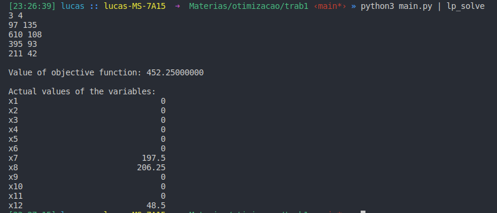

### Sobre

Esse repositório tem como objetivo mostrar a implementação do trabalho 1 da matéria de Otimização 2020 - ERE3 da UFPR

### O problema

**Escalonamento de uso no tempo**  
Uma empresa aluga máquinas(para uso remoto) sob demanda de seus clientes. A única restrição é que as máquinas só podem ser usadas durante um mesmo dia de trabalho (expediente de 8h às 17h). Possivelmente maisde  um  destes  usos  podem  ser  alugados  num  mesmo  dia  para  uma  mesmam ́aquina,  se  a  soma  dos  tempos  for  menor  que  as  9  horas  do  expediente.Cada cliente pede quanto tempo, em minutos, vai usar uma m ́aquina.  Essetempo deve estar entre 0 e 540 minutos.
A  empresa  tem maquinas. Ao receber um conjunto de pedidos, o gerente da empresa precisa escalonar em qual maquina e em qual dia cada uso vai ser feito.
Considere que a demanda (pedidos) ́e dada por um conjunto de *n* pares(ni, ti), onde *ni* ́e o numero de pedidos de tempo ti, com 1 ≤ i ≤ n.
Queremos minimizar o numero de dias necessario para atender aos pedidos da demanda

### Como funciona o algoritmo

lorem ipsum dolor met a sit

### Exemplo de entrada

```bash
$ python3 main.py | lp_solve

3 4
97 135
610 108
395 93
211 42
```

```bash
$ python3 main.py | lp_solve

3 4
10 200
5 330
10 420
8 500
```
### Saída
O programa gerará na saída padrão entradas para o programa lp_solve

O exemplo de entrada
```bash
3 4
10 200
5 330
10 420
8 500
```

gerará a saída
```bash
min : x1  + x2  + x3  + x4 ;
c1: 0x1 + 0x2 + 0x3 + 1x4 >= 8;
c2: 0x1 + 0x2 + 1x3 + 0x4 >= 10;
c3: 0x1 + 1x2 + 0x3 + 0x4 >= 5;
c4: 2x1 + 1x2 + 0x3 + 0x4 >= 10;
x1  >= 0;
x2  >= 0;
x3  >= 0;
x4  >= 0;
```

### Imagens Adicionais




